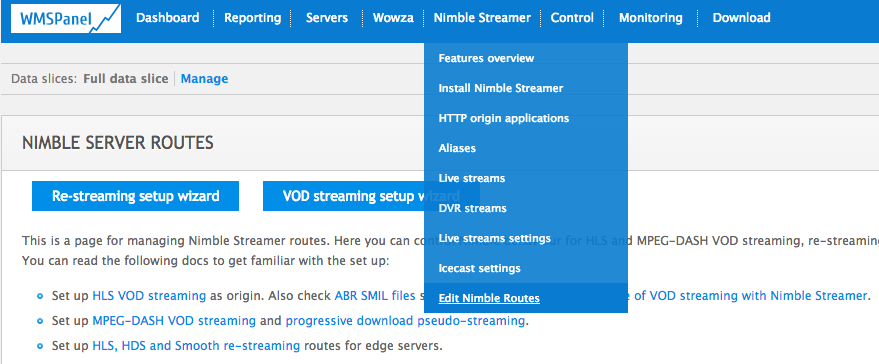
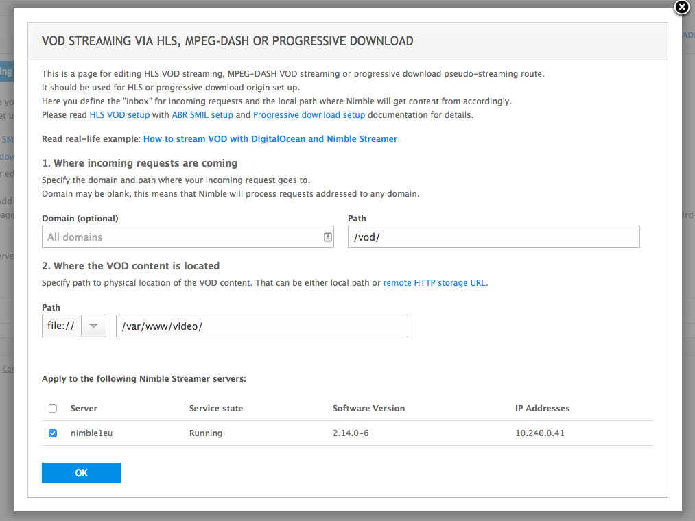
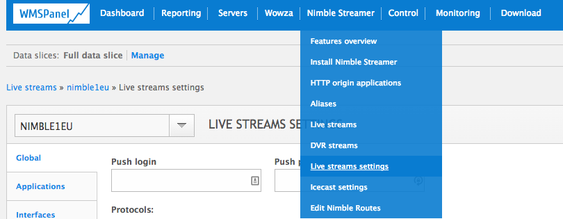
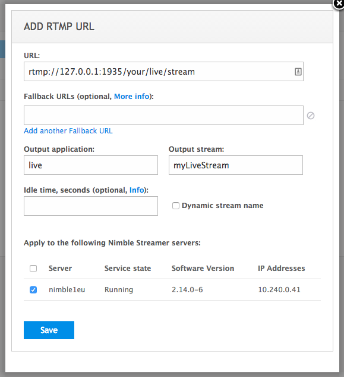
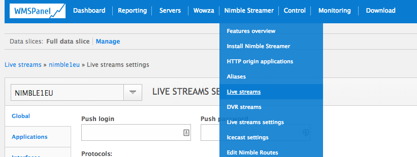
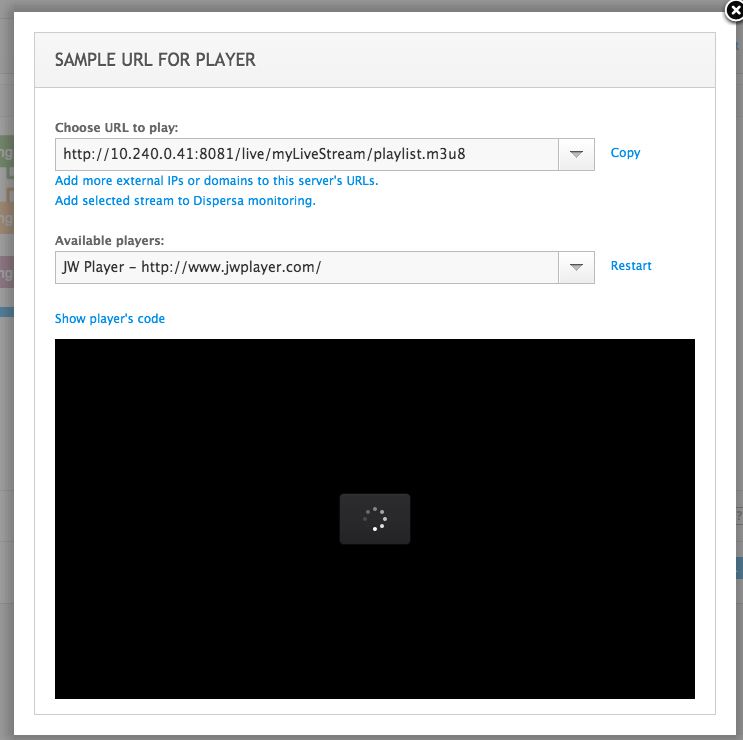

# HLS With Nimble

## Intro
WMSPanel's Nimble is a fantastic lightweight media server.
We are going to show how to configure Nimble and stream HLS with Peer5.

## Setup CORS 
Peer5 needs CORS to get the video segments from your server:

1. Open your config file (Usually located at `/etc/nimble/nimble.conf`).
2. Add the following lines at the bottom of the file:
	+ `access_control_allow_origin = *`
	+ `access_control_allow_headers = Range`
	+ `access_control_expose_headers = Content-Length, Content-Range`
3. Save the file.
4. Restart the nimble service using this command: `sudo service nimble restart`.

## Setup VOD HLS Stream
1. Copy the mp4 video file you want to stream to a path that will be accessible by the nimble user on your server, Lets say `/var/www/video/`.
2. On the navigation panel: `Nimble streamer -> Edit nimble routes`.
	  
	
	   
	
3. Select `ADD VOD STREAMING ROUTE` on the top right.

4. Fill the form and press OK.
	  
	
	   
	
5. your route will be added to the table, select `GET URL for player`, copy the url and replace sample.mp4 with your video file name.
 You might also need to replace the IP address with your server’s external IP.

6. you can now play the url in your HLS player.

## Setup Live (RTMP transmuxing to HLS)

1. On the navigation panel: `Nimble streamer -> Live streams settings`.
	   
	
	   
	
2. Under Global tab -  Set chunk duration to `3` and Chunk count to `10`. Then press Save.
	   
	
	   
	
3. Select Live pull settings tab.
	   
	
	   
	
4. Select Add RTMP URL.

5. Fill your RTMP stream url, application name (i.e live) and name for your output stream. Then press Save.
	   
	
	   
	
6. Go back to the top navigation bar and select Live streams.
	   
	
	   
	
7. Choose your server from the list on the bottom.
	   
	
	   
	
8. Click `Outgoing stream` (the pink part of the drawing), your stream should appear.

9. Press the question mark on the right side of your stream’s line.

10. This window will appear:
	   
	
	   
	
11. You might need to replace the IP address with the external address of your server.

12. Your HLS stream can now be played via this url.
