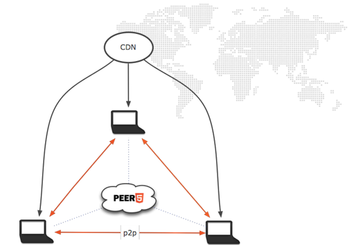
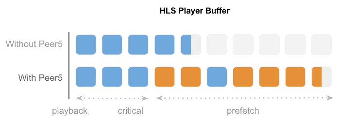

# Peer5 Video Overview

Peer5 operates as a service that orchestrates peers and provides analytics and control.
The service is activated using our Javascript API in the browser.
The client side consists of custom [WebRTC](http://webtrc.org) p2p logic,
an HTTP client and a delivery manager that optimizes speed using the two methods ([P2P](https://en.wikipedia.org/wiki/Peer-to-peer) and HTTP).

The client connects to multiple peers and to the HTTP server simultaneously and ensures chunks are received in time for playback. 

## Integration

Since Peer5 is SaaS and uses only Javascript, the integration is seamless to the end-user and only requires a small change in your site's HTML page.

### Client-Side Integration

Client-side integration depends on the player you are using and usually means adding one or two lines of code to your page.  
We support many common players, such as:

- [Clappr](players/clappr/)
- [VideoJS](players/videojs/)
- [JWPlayer](players/jwplayer-7/)
- [Flowplayer](players/flowplayer/)
- [Shaka Player](players/shaka-player/)

Please visit [Our integration page](https://app.peer5.com/integration) for assistance 
or contact us if our current solution doesn't fit your needs.

### Server Side Requirements

Depending on the software you are using, you may need to configure additional CORS headers.  
You can test your playlist file [here](https://app.peer5.com/integration)
 
## Optimizing Stream for efficient P2P

In order to achieve higher p2p throughput, we recommend the following configurations:

1. Playlist length - 30 seconds or more
2. Number of segments - 10 or more
3. Segment size - under 1MB 
4. URL randomization and protection - We work with many of the schemes for content protection.
To identify media files and connect users, we use the url without a querystring by default. 

**Example I:** user A gets 1.ts?id=xyz and user B gets 1.ts?id=abc  
We will remove the dynamic URL and will be able to connect between users.

**Example II:** user A gets xyz/1.ts and user B gets abc/1.ts  
In this case, we will not be able to identify the files correctly by default. This requires additional configuration.
	
Our system can digest different randomized URLs using custom regex that you can setup - please contact us if your URLs contain random text other than query strings.

## Security

Peer5 uses WebRTC to transfer data between users. The channel we use is secured using SCTP protocols and TLS encryption.
Communication with our backend is done via secured WebSocket, which also uses TLS encryption.

Existing content protection schemes remain the same when Peer5 is enabled. Each user session starts with a standard client-server,
manifest request and media request. The p2p aspect only starts to work after the user is authorized.
The server sees the same exact requests (tokens, keys, cookies, etc.) with and without Peer5.

**DRM and stream encryption** doesn't interfere with Peer5's technology, since the content sent 
between users is still the same when encrypted. The Peer5 service doesn't compromise the stream in any way,
since users that view the stream have already been authenticated by the server and have received a decryption key - which,
importantly, isn't transferred through the Peer5 network. Content is also never stored locally or in any persistent data storage.

## User Experience
Peer5 saves server bandwidth only when there is no risk of harming the user experience (UX).
Peer5 prioritizes UX and reliability above all else, therefore the hybrid p2p / HTTP switching algorithm
only uses peers when the end user will benefit from this. When there are no peers,
or when the UX might deteriorate, Peer5 falls back to HTTP delivery.

The diagram above shows a typical HLS player buffer (both with and without Peer5),
and illustrates how Peer5 divides the buffer into a critical portion and a prefetch portion.

Without Peer5, all segments are fetched via HTTP (blue squares).

With Peer5, one can see hybrid delivery in action, as evidenced by the presence of 
orange squares (i.e. segments fetched via p2p) in the prefetch portion of the buffer.
Because we use HTTP delivery to fill the critical portion of the buffer,
one can see that Peer5 doesn't add any delay to the playback experience.  
Once the critical portion is filled, however, Peer5 leverages p2p delivery to dramatically 
reduce HTTP traffic yet still stay ahead of the player. Small video segments allow for more diversified 
delivery, and this is the primary reason we recommend configuring your streaming server to output 
many small segments rather than a small number of large segments.

In cases where the end-user can't fetch segments via HTTP fast enough to fill the critical portion of the buffer,
either because he's far from the server or the server is overloaded,
the p2p prefetching will actually improve UX since the end-user will have more sources from which to download the required segments.

## Peer Efficiency
Peer Efficiency is the percentage of content that is offloaded to the p2p network at a given time.
HTTP-based CDNs use the term cache hit ratio, which is a very similar concept.
CDNs usually measure the ratio as requests served from the CDN divided by the total number of requests.
Peer Efficiency is calculated by dividing the number of bytes delivered from the p2p network by the total number of bytes delivered (p2p + HTTP).

Peer Efficiency depends on many factors, including the quality of end-users' Internet connections,
network proximity, and more. One of the most important factors is the number of concurrent users.
Although Peer5 is most efficient for very popular content, we see excellent offloading ratios even
when there is a small number of concurrent viewers. In fact, we have achieved 50% peer efficiency with only 5 concurrent viewers.
This means that even less popular content can be efficiently delivered with Peer5.

## Adaptive Bitrate (ABR)
Peer5 supports adaptive bitrate technologies but does not interfere with them. 
The prefetcher requests segments from the same rendition (level) it currently resides in.
Peers from different renditions do not share segments with each other.

## Supported Platforms

### # Browsers
Peer5 operates with complete p2p functionality on Chrome, Firefox and Opera.
 Other browsers gracefully fallback to an HTTP only mode, where servers deliver all of the content.

### # Mobile
Peer5 is extremely UX focused, and for that reason, on mobile, we only enable content download (i.e., not upload).
 We do this in order to optimize streams and minimize resource usage. 

## Stats API
To monitor statistics from the client side, one can use [peer5.getStats()](./apis/get-stats.md),
 which returns a JSON object with different metrics relating to the performance of the p2p network.
