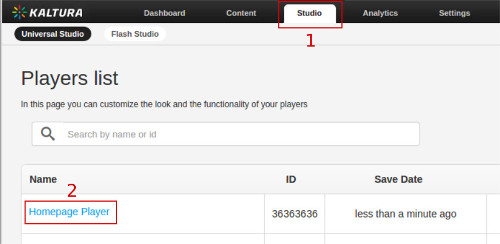
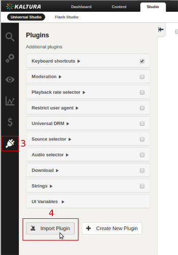
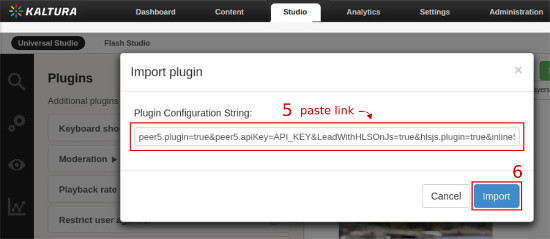
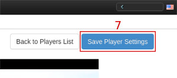

# Kaltura with Peer5 Integration

 
[Kaltura](http://kaltura.com/) is a media company offering video platform as a service.

Integration is made through Kaltura's dashboard, follow this steps to integrate you player with Peer5.

## Integration Steps

#### **1\.** Open <a target="_blank" href="http://www.kaltura.com/index.php/kmc">Kaltura Dashboard</a>
#### **2\.** Go into 'studio' section  
#### **3\.** Click on an existing player or create a new one

---

#### **4\.** Go into plugins menu  
#### **5\.** Click on the 'import plugin' button

---

#### **6\.** Paste this text into the box:  
#### **7\.** Click on the import button

---

#### **8\.** Click 'Save Player Settings' button

---

#### **9\.** For the new changes to apply, new embed code must be created through 'content' section

---

Need extra help? <a href="javascript:Intercom('show')">Chat with us</a> or [send us an email](mailto:info@peer5.com)